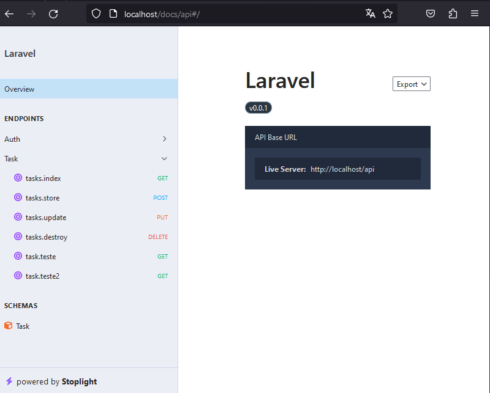
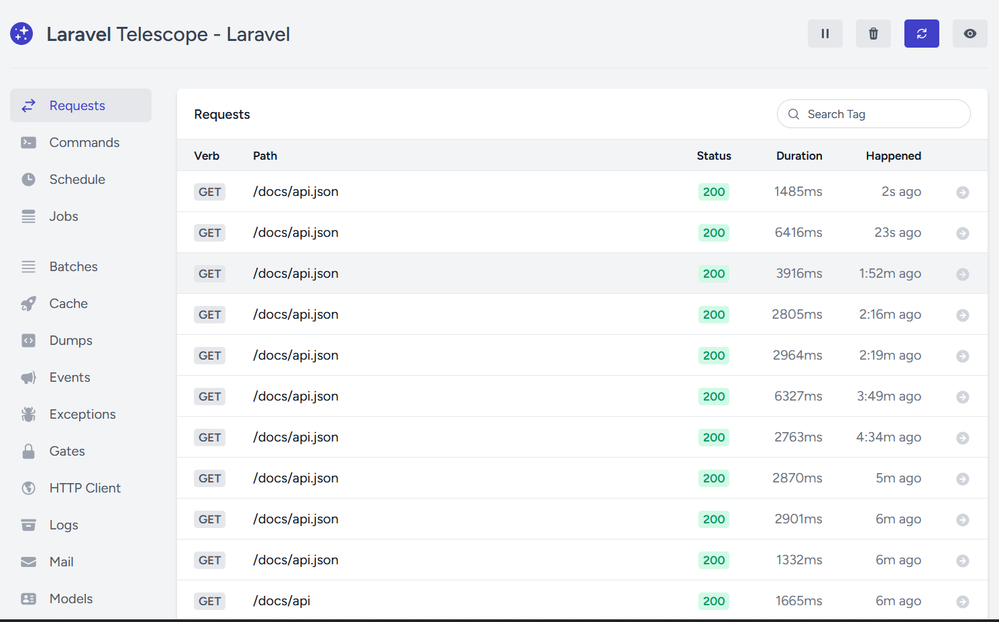

# Laravel playground

Projeto utilizado para testar libs/integrações e estudos de backend.

- Sail.
- Telescope.
- Scramble
- S3 (Integração padrão do storage do laravel).

## Como Executar o Projeto

- Instalar as dependências.
    > composer install

    Caso não queira instalar as dependências localmente, é possível já instalar as dependências dentro do container da aplicação com o seguinte comando:
    ```shell 
        docker run --rm \
        -u "$(id -u):$(id -g)" \
        -v "$(pwd):/var/www/html" \
        -w /var/www/html \
        laravelsail/php82-composer:latest \
        composer install --ignore-platform-reqs
    ```

> No comando de instalação das dependências via docker, na referência do container "laravelsail/php82-composer:latest" o 82 se refere a versão do php 8.2, para uma versão diferente fazer a alteração no comando. Lembrando que deve ser a mesma versão da aplicação.

- Copiar o conteudo do arquivo [.env.example](.env.example) e criar um arquivo .env com as informações necessárias.

- Criar uma chave de aplicação com um dos comandos seguintes
    |Instalação Local| Instalação no container|
    |--|--|
    |php artisan key:generate| ./vendor/bin/sail artisan key:generate|

O projeto utiliza a biblioteca de cli [Sail](https://laravel.com/docs/10.x/sail) para gerenciar os containers da aplicação. 
Recomendo [configurar um alias](https://laravel.com/docs/10.x/sail#configuring-a-shell-alias) para executar os comandos. 

| Ação | Comando (com alias) |
|--|--|
|Inicializar os containers  | sail up -d|
|Encerrar os containers| sail down|
|Comando artisan| sail artisan [comando]|
|Comando composer| sail compose [comando]|
|||

- Executar as migrations
    > sail artisan migrate 
- Preencher as tables com dados dummy*
    > sail artisan db:seed

## Tasklist API
|  |  |
|--|--|
|Documentação|/docs/api|
|Controller|[TaskController](./app/Http/Controllers/TaskController.php)|
|Rotas|[Rotas](./routes/api.php)|
|Validação de dados| [TaskRequest](./app/Http/Requests/TaskRequest.php)|

### Como fazer uma request

- Post para a rota api/token passando email e senha no corpo do request. *OBS:* é possível utilizar os valores padrão gerados no seed do banco.
    
    |field|value|
    |--|--|
    |email|test@example.com|
    |password|password|
- Adicionar token resultado da request anterior como Authorization ao header nas requests seguintes

## Scramble
Biblioteca de documentação de API. [Documentação](https://scramble.dedoc.co/)


## Telescope
Biblioteca de monitoramento da API. [Documentação](https://laravel.com/docs/10.x/telescope)
